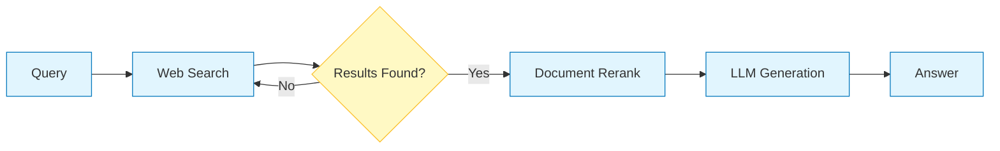

# Global Auto Regulations AI (글로벌 자동차 규정 AI)


## 📌 프로젝트 개요 (Project Overview)

**Global Auto Regulations AI**는 전 세계 자동차 안전 규정(FMVSS, ECE, KMVSS)을 통합하여 검색, 비교, 분석할 수 있는 **RAG(Retrieval-Augmented Generation)** 기반의 지능형 AI 시스템입니다.

방대하고 복잡한 법규 문서를 전문가 수준으로 이해하고, 사용자의 자연어 질문에 대해 **정확한 근거(출처)**를 바탕으로 답변을 제공합니다. 특히 **다국어(한국어/영어) 환경**에서의 검색 정확도와 답변 신뢰성을 최우선으로 설계되었습니다.

---

## 🌟 핵심 기능 및 차별점 (Key Features)

### 1. 🌍 다국어 규정 통합 검색 및 비교
- **미국(FMVSS)**, **유럽(ECE)**, **한국(KMVSS)** 규정을 하나의 인터페이스에서 통합 검색합니다.
- **"한국과 유럽의 보행자 머리 상해 기준 비교해줘"**와 같은 복합 질문에 대해, 각국의 관련 규정을 찾아 표 형태로 비교 분석합니다.

### 2. 🧠 언어별 특화 검색 알고리즘 (Language-Specific Retrieval)
- **문제점:** 일반적인 Reranker 모델은 영어 데이터에는 강하지만 한국어 데이터 처리 시 점수 왜곡이 발생하여 관련 문서를 탈락시키는 문제가 있었습니다.
- **해결책 (Dual Strategy):**
    - **영어 문서 (FMVSS/ECE):** `FlashRank` (ms-marco)를 사용하여 정밀하게 재순위화(Reranking).
    - **한국어 문서 (KMVSS):** 검색 엔진(BM25+Vector)의 원본 순위를 신뢰하여 유지.
    - **교차 병합 (Interleaving):** 두 결과를 1:1 비율로 섞어 상위권에 다국어 문서가 균형 있게 배치되도록 보장.

### 3. 🔍 정밀한 근거 확보 (Deep Retrieval)
- **KMVSS 별표/시험방법 타겟팅:** 한국어 질문 시 자동으로 `"충격시험방법"`, `"별표"` 등의 키워드를 쿼리에 추가하여, 단순 조항뿐만 아니라 구체적인 **기술적 세부 기준(Annex)**까지 찾아냅니다.
- **하이브리드 검색 (Hybrid Search):** `BM25`(키워드 매칭)와 `Vector Search`(의미 매칭)를 결합하여 정확한 규정 번호와 문맥적 의미를 모두 포착합니다.

### 4. 🛡️ 답변의 신뢰성 및 투명성 (Reliability)
- **출처 표기 강제:** 모든 답변 문장에 `[Source: ID]` 형태의 인용구를 부착하여 할루시네이션을 방지합니다.
- **문서 적합성 평가 (Grading):** 검색된 문서가 질문과 관련이 있는지 LLM이 2차 검증(Grading)을 수행하고, 부적합한 문서는 답변 생성에서 배제합니다.
- **UI 시각화:** 답변에 사용된 문서를 **국가별 탭**과 **카드 UI**로 깔끔하게 정리하여 사용자가 원문을 즉시 대조할 수 있습니다.

---

## 🏗️ 시스템 아키텍처 (Architecture)

이 프로젝트는 **LangGraph**를 활용하여 유연하고 확장 가능한 워크플로우를 구현했습니다.

### Workflow Diagram
`질문 입력` -> `질의 변환` -> `검색(BM25+Vector)` -> `재순위화(Ko/En 분리)` -> `적합성 평가` -> `답변 생성`

1.  **Input Parsing**: PDF/XML 형태의 규정 문서를 파싱하고 의미 단위로 청킹(Chunking)합니다.
2.  **Indexing**: `Multilingual MiniLM` 모델로 임베딩하여 ChromaDB에 저장하고, BM25 인덱스를 생성합니다.
3.  **Graph Execution**:
    *   **Transform Query**: 사용자 질문을 분석하여 한국어(상세 검색용)와 영어(번역 검색용) 쿼리를 생성합니다.
    *   **Retrieve**: 다국어 쿼리로 병렬 검색을 수행합니다.
    *   **Rerank**: 언어별 특성에 맞는 전략으로 문서를 정렬합니다.
    *   **Grade**: LLM이 문서의 유용성을 평가합니다.
    *   **Generate**: `Gemini 2.0 Flash` 모델이 최종 답변을 작성합니다.

### Simplified Web Search Workflow
(요청하신 웹 검색 기반의 단순화된 워크플로우 시각화)



---

## 💻 기술 스택 (Tech Stack)

### 1. Large Language Model (LLM)
*   **Model:** **Google Gemini 2.0 Flash**
*   **사용 목적:** 사용자 질의 의도 분석, 검색된 문서의 적합성 평가(Grading), 최종 답변 생성.
*   **선정 의의:** 긴 문맥(Long Context) 처리에 강점이 있어 방대한 법규 문서를 한 번에 참조하기 유리하며, 추론 속도가 빨라 실시간 검색 서비스에 적합합니다.
*   **현재 파라미터:**
    *   `temperature = 0.0`: 법률/규정 데이터의 특성상 창의성보다는 **사실성(Factuality)**과 **일관성**이 중요하므로 무작위성을 제거했습니다.

### 2. Orchestration Framework
*   **Library:** **LangChain**, **LangGraph**
*   **사용 목적:** RAG 파이프라인의 전체 워크플로우(검색 -> 재순위화 -> 평가 -> 생성) 제어 및 상태 관리.
*   **기대 효과:**
    *   **LangGraph** 도입을 통해 단순한 선형 체인이 아닌, **순환형(Cyclic) 프로세스**를 구현했습니다. (예: 검색 결과가 부적합하면 질의를 수정하여 재검색)
    *   각 노드(Node) 간의 상태(State)를 공유하여 복잡한 로직을 모듈화했습니다.

### 3. Search & Retrieval (RAG Core)
*   **Hybrid Search:** **BM25 (Keyword)** + **Vector Search (Semantic)**
    *   **의의:** 정확한 조항 번호 매칭(BM25)과 문맥적 의미 검색(Vector)의 장점을 결합하여 재현율(Recall)을 극대화했습니다.
    *   **파라미터:** `RETRIEVER_K = 25` (기본 4~5개보다 훨씬 많은 문서를 후보로 추출하여, 놓치기 쉬운 별표/부록(Annex) 데이터까지 확보)
*   **Reranking:** **FlashRank (ms-marco-MiniLM-L-12-v2)**
    *   **사용 목적:** 1차 검색된 다량의 문서(25개)를 질문와의 관련성 순으로 정밀 재정렬.
    *   **기대 효과:** 한국어와 영어 문서가 섞여 있을 때, 단순히 점수가 높은 순이 아니라 실제 질의와의 연관성을 기준으로 상위 문서를 선별하여 정확도 향상.

### 4. Vector Database & Embedding
*   **Database:** **ChromaDB**
    *   **특징:** 로컬 파일 기반으로 가볍게 구동되면서도 빠른 벡터 검색 속도 제공.
*   **Embedding Model:** **sentence-transformers/paraphrase-multilingual-MiniLM-L12-v2**
    *   **선정 이유:** 한국어와 영어를 동시에 지원하는 경량 모델 중 성능이 우수하여, 다국어 규정 비교 검색에 최적화됨.
    *   **Chunking 설정:**
        *   `CHUNK_SIZE = 2000`: 규정 문서 내의 긴 표나 조항 전체를 하나의 맥락으로 유지하기 위해 크게 설정.
        *   `CHUNK_OVERLAP = 400`: 문맥이 잘리는 것을 방지하기 위한 중복 구간.

### 5. Data Processing & UI
*   **Parser:** **LXML** (XML), **PDFPlumber** (PDF)
    *   구조화된 법규 데이터(XML)와 비정형 데이터(PDF)를 텍스트로 변환 및 정제.
*   **Frontend:** **Streamlit**
    *   Python만으로 빠르게 대화형 웹 인터페이스를 구축하여 프로토타이핑 및 배포 효율성 증대.

---

## 🚀 설치 및 실행 (Installation & Usage)

### 1. 환경 설정
```bash
# 1. 저장소 클론
git clone [repository_url]
cd FMVSS

# 2. 가상환경 생성 및 활성화
python -m venv venv
# Windows
venv\Scripts\activate
# Mac/Linux
source venv/bin/activate

# 3. 패키지 설치
pip install -r requirements.txt
```

### 2. API 키 설정
`.env` 파일을 생성하고 Google API 키를 입력하세요.
```env
GOOGLE_API_KEY=your_google_api_key_here
```

### 3. 데이터 준비 (최초 1회)
최초 실행 시 데이터 수집 및 DB 구축 과정이 필요할 수 있습니다. UI 사이드바의 **[전체 재구축]** 버튼을 통해 실행할 수 있습니다.

### 4. 앱 실행
```bash
streamlit run src/interface/streamlit_app.py
```

---

## 🛠️ 문제 해결 (Troubleshooting)

**Q. 검색 결과에 한국 규정의 상세 수치가 안 나와요.**
*   A. 사이드바의 **'검색 범위 설정'**에서 'KR'이 체크되어 있는지 확인하세요. 또한 **'검색 정확도'**를 낮추거나(0.3), 질문에 "별표" 또는 "세부기준"이라는 단어를 포함하면 더 잘 찾아냅니다. (시스템이 자동으로 "충격시험방법" 등을 추가하긴 합니다.)

**Q. 답변 생성이 너무 느려요.**
*   A. 초기 실행 시 모델 로딩(BM25 인덱싱, Reranker 로드)에 시간이 소요될 수 있습니다. 이후에는 캐싱되어 빨라집니다. Gemini API 응답 속도에 따라 차이가 있을 수 있습니다.

**Q. 'StreamlitDuplicateElementKey' 에러가 떠요.**
*   A. UI 렌더링 시 발생하는 버그로, 현재 코드에서는 `uuid`를 적용하여 해결되었습니다. 앱을 새로고침(F5) 해주세요.

---

## 📝 라이선스 (License)
This project is for educational and research purposes. (MIT License)
